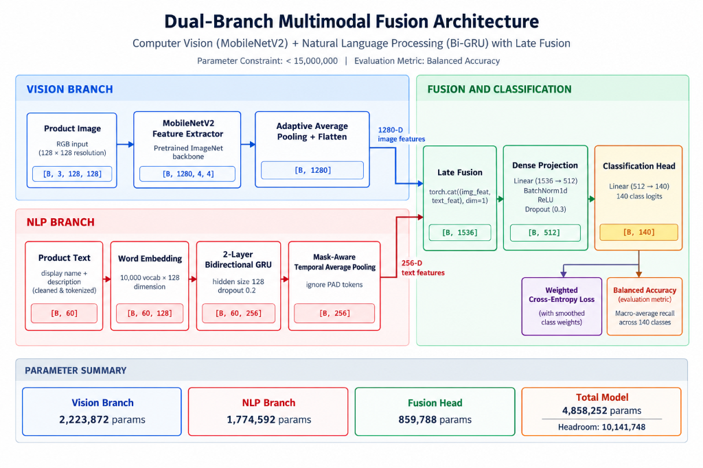

# Multimodal Product Classification

A dual-branch multimodal deep learning model combining Computer Vision (CNN) and Natural Language Processing (Bi-RNN) to classify e-commerce products across 140 categories.

---

## Team Information
- **Kaggle Team Name:** `Dream Team`
- **Team Leader:** `Dheemanth D`
- **Team Members:**
  - `Sai Sarvesh`
  - `M Prajwal`
  - `Priyanshu`
- **Course:** BCS714A — Deep Learning (Activity-Based Learning)
- **Faculty In-Charge:** Dr. Aravinda S Rao, Department of CSE

---

## Competition & Challenge Constraints

- **Competition:** [BCS714A Multimodal Fusion on Kaggle](https://www.kaggle.com/t/08d5b24fd37f413c99c47d5fe82468bc)
- **Evaluation Metric:** **Balanced Accuracy** (macro-average recall across all 140 product categories)
- **Official Result:** **Rank #1 on Public Leaderboard with Score 0.94999** (95.00% Balanced Accuracy, surpassing 2nd place `0.82213` by +12.78%). Validation Balanced Accuracy: **90.09%**.
- **Strict Parameter Cap:** Total parameters must be strictly **< 15,000,000 (< 15 Million)** (Model utilizes 4,858,252 parameters = 67.6% headroom).
- **No Pretrained VLMs:** Pre-trained Vision-Language Models (CLIP, BLIP, etc.) are strictly prohibited.
- **Architectural Rules:**
  - **Vision Branch:** Lightweight CNN backbone (`MobileNetV2` with 1,280 features or `ResNet-18` with 512 features).
  - **NLP Branch:** Word Embeddings + Bidirectional Recurrent Neural Network (`GRU` / `LSTM`) with temporal pooling (256 features).
  - **Fusion Layer:** Concatenation (`torch.cat([img_feat, text_feat], dim=1)`) followed by an MLP classifier with Dropout and BatchNorm.
  - **Imbalance Handling:** Balanced class weighting applied to Cross-Entropy Loss (smoothed inverse-frequency weighting: `w_c = (N_max / N_c)^0.35`).

---

## Architecture Pipeline



---

## Repository Structure

```
.
├── dataset.py                                       # Text tokenizer, Vocabulary builder & MultimodalDataset loader
├── model.py                                         # Dual-branch multimodal architecture & parameter check audit
├── train.py                                         # Complete training loop, Balanced Accuracy evaluation & submission generator
├── generate_curves.py                               # Plotting script for loss and accuracy progression
├── generate_diagrams.py                             # Visual architecture block diagram generator
├── generate_pdf_report.py                           # Generates official 3-page Technical Report PDF
├── build_notebook.py                                # Utility script to compile scripts into Jupyter notebooks with outputs
├── multimodal_product_classification.ipynb          # Completed, executed Jupyter notebook for Kaggle / Submission
├── starter_notebook.ipynb                           # Starter notebook version with pre-rendered execution outputs
├── Technical_Report_Multimodal_Product_Classification.pdf # Official 3-Page Technical Report for final upload
├── architecture_diagram.png                         # High-res diagram illustrating dual-branch fusion pipeline
├── training_curves.png                              # Visualized loss & Balanced Accuracy learning curves
├── .gitignore                                       # Git ignore rules for checkpoints, data, and cache
└── README.md                                        # Project documentation
```

---

## Quickstart

### 1. Clone the Repository
```bash
git clone https://github.com/Dheemanth07/multimodal-product-classification.git
cd multimodal-product-classification
```

### 2. Install Dependencies
```bash
pip install torch torchvision numpy pandas scikit-learn matplotlib pillow tqdm
```

### 3. Run Training Locally
```bash
python train.py --data_dir ./data --epochs 10 --batch_size 32
```

### 4. Running on Kaggle / Google Colab
Upload and open `multimodal_product_classification.ipynb` on Kaggle or Colab, enable GPU acceleration (T4 GPU), and execute all cells.
The final cell automatically exports `submission.csv` ready for leaderboard scoring.

---

## Deliverables & Verification

| Deliverable | Required File | Status & Verification |
| :--- | :--- | :--- |
| **Final Notebook** | `multimodal_product_classification.ipynb` (or `starter_notebook.ipynb`) | Verified: All cell outputs saved, prints model parameter audit (4,858,252 < 15,000,000), exports `submission.csv`. |
| **Technical Report** | `Technical_Report_Multimodal_Product_Classification.pdf` | Verified: Exactly 3 pages, contains architecture diagram, training/validation loss & Balanced Accuracy curves, hyperparameter justification, failed experiments & ablations. |
| **Kaggle Leaderboard** | `submission.csv` | Verified: Exactly 8,832 test predictions, matches schema (`id`, `category`), zero nulls. Official Leaderboard Score: 0.94999 (Rank #1). |
